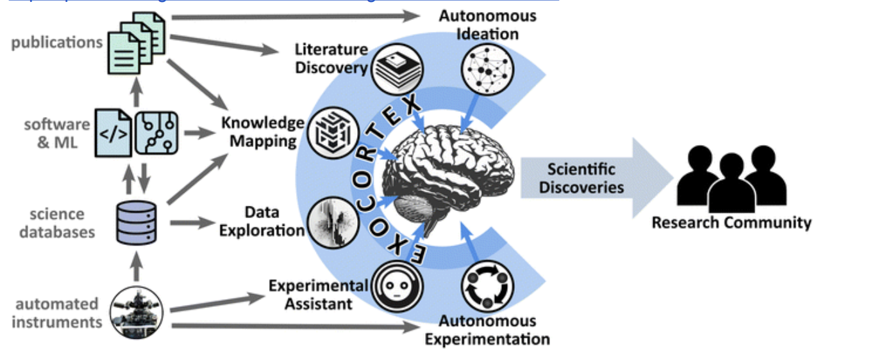

# 🧠 Exocortex: Brain dump, but smarter
### Motivation : This project extends the concept of "exocortex" proposed in:

##  Yager, Kevin G. (2024). Towards a science exocortex. Digital Discovery, 3(10). https://doi.org/10.1039/D4DD00175K

Yager outlines a vision for augmenting scientific reasoning through AI-powered tools capable of structuring, critiquing, and accelerating research workflows. This repository serves as a proof of concept for that vision, operationalizing a system where a swarm of AI agents engage in deliberative reasoning. Specifically, every agent invoked in support of a hypothesis is paired with a counter-agent tasked with critically evaluating its claims, ensuring that conclusions arise through structured opposition rather than passive agreement.

This repo, is a step towards that idea. 


This prototype demonstrates the concept through a pipeline of reasoning agents. A **support agent** searches the literature for evidence in favor of a given hypothesis. An **oppose agent** then inverts the query to uncover contradictory or skeptical perspectives. Finally, a **synthesis agent** compares both outputs, identifies conflicts and research gaps, and proposes future directions or experiments to resolve ambiguity.

This deliberative pattern can be extended across the entire agentic swarm—for example:
- A data agent may construct both primary and inverse queries to identify bias in databases.
- An autonomous lab executor could test alternate procedures to ensure robustness in physical experimentation.

By embedding structured opposition into multi-agent workflows, this system moves towards the realization of a critical, reflective, and self-aware scientific exocortex.

### Project Structure 
```bash
.
├── Agents/
│   └── research_agent.py       # Defines 3 agents: support, oppose, synthesize
├── Tasks/
│   └── research_task.py        # Defines 3 tasks matching the agent flow
├── Tools/
│   ├── publication_tool.py     # Fetches papers via arXiv API
│   └── embed_papers.py         # Embeds paper abstracts (uses fastembed)
├── main.py                     # Entrypoint
├── crew.py                     # Defines agents + tasks into a crew
├── requirements.txt            # Python dependencies

```
You can find sample outputs under Outputs/ folder for each task

### How It Works
You ask a question e.g. "Do foundation models show emergent reasoning?"
The crew:
- support agent fetches supporting papers
- oppose agent fetches contradictory papers
- synthesize agent analyzes the conflict, assumptions, and blind spots

The system outputs:
- cited summary from each agent
- alignments, conflicts and gap for research


Getting Started
1. Clone the repo
``` bash

git clone https://github.com/SnehaDharne/exocortex.git
cd exocortex

```
2. Set up a virtual environment
```bash
python3 -m venv venv
source venv/bin/activate
```

3. Install dependencies
```bash
pip install -r requirements.txt
```

4. Set your API key (for Gemini or OpenAI)
Create a .env file:

```ini
GEMINI_API_KEY=your_key_here
```

5. Run the main script
```bash
python main.py
```
    
